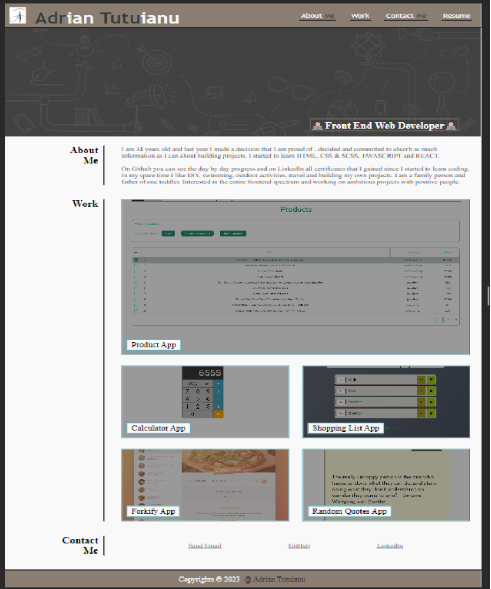

# Portfolio - Adrian Tutuianu

## Description

Welcome to my personal portfolio! This single-page website is a showcase of my skills and projects, crafted using HTML and CSS. Dive into my journey, explore my projects, and get to know me better. From web development to design, this portfolio reflects my passion for creating compelling digital experiences. Feel free to explore and reach out—I'm excited to connect!

Technologies Used:

HTML
CSS 

This website was deployed and you can see it live here: https://adriantutuianu.github.io/module-2-portfolio-working-with-css-challenge/

## Installation

N/A

## Usage 

## Credits

Edx Front End Web Bootcamp 

## License

MIT License 

